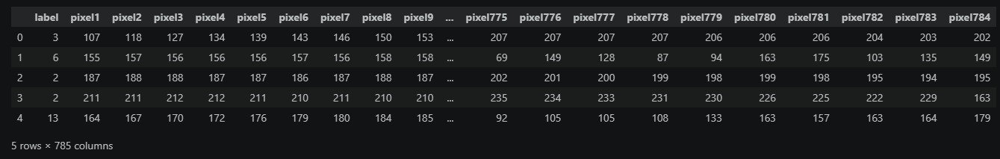
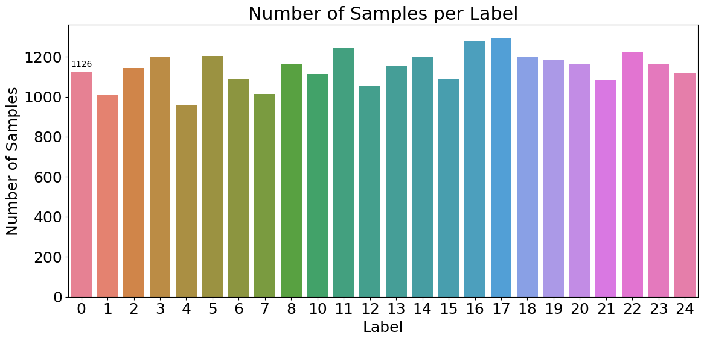
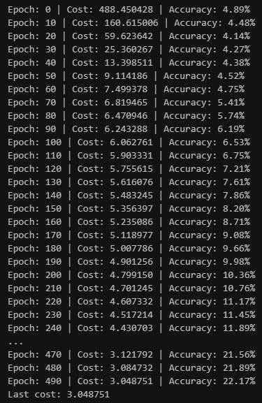
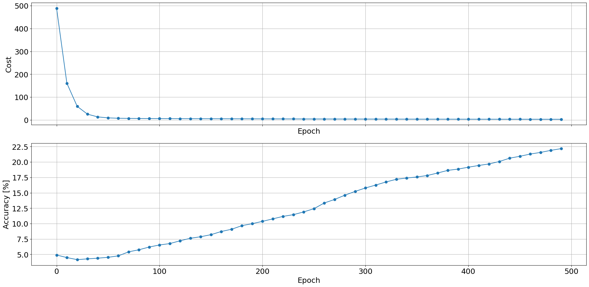
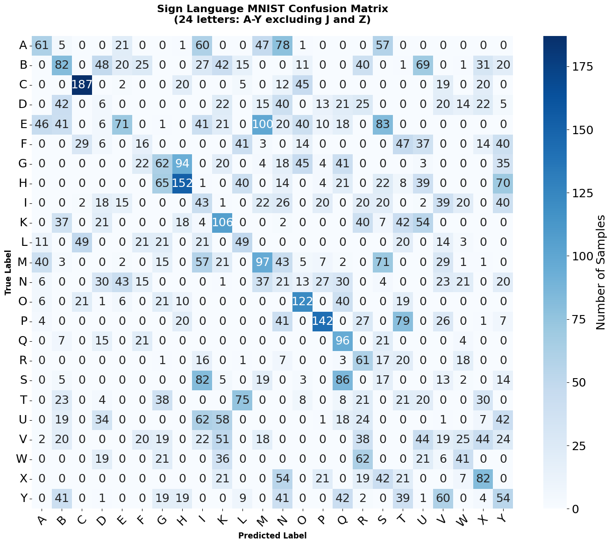

# 🤟 Sign Language Classification with Multinomial Logistic Regression from Scratch


> A NumPy-based Multinomial Logistic Regression model implemented from scratch for multi-class image classification on the Sign Language MNIST dataset. The project implements softmax classification, cross-entropy loss, L2 regularization, gradient descent, and model evaluation without using machine learning frameworks.

## 📖 Overview

This project implements a `Multinomial Logistic Regression` model from scratch using Python and NumPy for image classification on the `Sign Language MNIST` dataset.

The objective is to build a multi-class classification model without relying on machine learning or deep learning frameworks. The implementation covers the main components required for training a multinomial logistic regression model, including data preprocessing, softmax classification, cross-entropy loss, gradient computation, L2 regularization, and gradient descent.

The Sign Language MNIST dataset contains grayscale images representing hand gestures for American Sign Language letters. The original dataset contains 25 classes, but the letters `J` and `Z` are excluded because they require hand movement and cannot be represented by static images. The remaining classes are relabeled from `0` to `23`.

## 📚 Original Assignment

The original assignment required implementing and training a `Multinomial Logistic Regression` model for multi-class image classification using the Sign Language MNIST dataset.

The project required:

- Implementing multinomial logistic regression from scratch using NumPy
- Implementing the `softmax` function
- Implementing cross-entropy loss
- Implementing gradient computation
- Applying L2 regularization
- Training the model using gradient descent
- Evaluating the model using classification accuracy
- Analyzing model performance using a confusion matrix

## ✨ Features

- 🧠 **Multinomial Logistic Regression from Scratch**
  - Fully implemented using NumPy
  - No machine learning or deep learning frameworks used
  - Vectorized matrix operations
  - Manual gradient computation

- 🤟 **Sign Language MNIST Classification**
  - Classification of 28 × 28 grayscale images
  - 784 pixel features per image
  - 24 static sign language classes
  - Training and test datasets loaded from CSV files
  - Letters `J` and `Z` excluded because they require movement

- ⚡ **Model Components**
  - Softmax output function
  - Cross-Entropy Loss
  - L2 regularization
  - Gradient descent
  - Bias term implemented through feature augmentation

- 📈 **Training and Evaluation**
  - Test accuracy monitoring during training
  - Training cost tracking
  - 500 training epochs
  - Test accuracy evaluation
  - Confusion matrix analysis

- 📊 **Visualization**
  - Dataset inspection
  - Class distribution visualization
  - Sign language image visualization
  - Training output
  - Cost and accuracy plots
  - Confusion matrix

## 🧠 Model Architecture

The implemented model consists of a linear layer followed by a Softmax output function.

Each `28 × 28` grayscale image is flattened into `784` pixel features. A bias term is added by augmenting the feature matrix with a column of ones.

| Layer | Configuration |
| ------- | ------------- |
| Input | 784 pixel features |
| Bias Augmentation | 784 → 785 features |
| Linear | 785 → 24 |
| Softmax | Output activation |
| Output | 24 classes |

The model predicts one of the `24` available static sign language classes.

## 🏗️ Model Architecture

The following diagram illustrates the high-level architecture of the implemented multinomial logistic regression model.

```text
                    Sign Language MNIST Dataset
                              │
                              ▼
                       CSV Dataset Loading
                              │
                              ▼
                       Data Preprocessing
                              │
                              ▼
                      28 × 28 Grayscale
                              │
                              ▼
                        Flatten Input
                           (784)
                              │
                              ▼
                      Normalize Pixels
                           [0, 1]
                              │
                              ▼
                       Add Bias Feature
                           (785)
                              │
                              ▼
                    ┌─────────────────┐
                    │  Linear Layer   │
                    │    785 → 24     │
                    └────────┬────────┘
                             │
                             ▼
                          Softmax
                             │
                             ▼
                    Class Probabilities
                       │            │
                       ▼            ▼
                Cross-Entropy    Accuracy
                     Loss
                       │
                       ▼
                Gradient Computation
                       │
                       ▼
                 L2 Regularization
                       │
                       ▼
                  Gradient Update
                       │
                       ▼
                  Model Training
                       │
                       ▼
                 Confusion Matrix
```

## 📂 Project Structure

```text
sign-language-logistic-regression-numpy/
├── .gitignore
├── sign-language-logistic-regression-numpy.ipynb
├── README.md
├── LICENSE
├── requirements.txt
└── Images/
    ├── 01-dataset-loading.png
    ├── 02-label-distribution.png
    ├── 03-data-visualization.png
    ├── 04-training-output.png
    ├── 05-training-results.png
    └── 06-confusion-matrix.png
```

## 🛠️ Built With

- Python
- NumPy
- Pandas
- Matplotlib
- Seaborn
- Scikit-Learn
- PrettyTable
- TablePrint
- Pillow
- Jupyter Notebook

## ⭐ Highlights

- Multinomial Logistic Regression implemented entirely from scratch using NumPy
- Sign Language MNIST image classification across `24 static sign language classes`
- Custom Softmax implementation for multi-class classification
- Cross-Entropy Loss for model training
- L2 regularization applied during optimization
- Gradient descent optimization
- Pixel normalization to the `[0, 1]` interval
- Bias term implemented through feature augmentation
- Training cost and accuracy monitoring across `500 epochs`
- Test accuracy evaluation on unseen data
- Confusion matrix analysis across all `24 Sign Language MNIST classes`
- Training cost and accuracy visualizations
- Refactored notebook with improved code organization, naming, and English documentation

## 🎯 Concepts Demonstrated

- **Multinomial Logistic Regression**
  The project implements a multinomial logistic regression model from scratch using NumPy for multi-class image classification.

- **Image Classification**
  The model classifies Sign Language MNIST images into `24 different static sign language classes`.

- **Feature Normalization**
  Pixel values are normalized from the original `[0, 255]` range to the `[0, 1]` interval before training.

- **Bias Augmentation**
  A column of ones is added to the feature matrix to incorporate the bias term into the linear model.

- **One-Hot Encoding**
  Integer class labels are converted into one-hot encoded vectors for multi-class classification.

- **Softmax**
  Softmax converts the linear model outputs into a probability distribution over the `24 classes`.

- **Cross-Entropy Loss**
  Cross-entropy loss is used as the training objective for the multi-class classification problem.

- **Gradient Descent**
  The model parameters are optimized using gradient-based updates calculated from the training data.

- **L2 Regularization**
  L2 regularization is applied to the model parameters to help reduce overfitting.

- **Accuracy Monitoring**
  Model accuracy is monitored throughout the training process.

- **Confusion Matrix Analysis**
  A confusion matrix is used to analyze classification performance across the `24 Sign Language MNIST classes`.

- **Model Evaluation**
  The trained model is evaluated on the unseen test dataset using classification accuracy.

- **Numerical Stability**
  The Softmax implementation subtracts the maximum value from each row before calculating exponentials to improve numerical stability.

## 📊 Results

- Trained for **500 epochs**
- Training samples: **27,455**
- Test samples: **7,172**
- Number of classes: **24**
- Accuracy monitored on the test set during training: **22.17%** at epoch 490
- Final test accuracy: **22.42%**
- Final cost: **3.048751**
- The model gradually improves its classification accuracy throughout training
- The confusion matrix provides a class-wise analysis of the model's classification performance across the 24 Sign Language MNIST classes

## 📸 Screenshots

### 1. Dataset Loading

The Sign Language MNIST dataset is loaded and inspected before training. The screenshot shows the structure of the dataset and the pixel values used as input features.



---

### 2. Label Distribution

The distribution of samples across the Sign Language MNIST classes is visualized to show the number of samples available for each class.



---

### 3. Data Visualization

Sample Sign Language MNIST images are visualized together with their corresponding letter labels.


---

### 4. Training Output

The training output shows the evolution of the cost and accuracy during the 500 training epochs.



---

### 5. Training Results

The plots show the evolution of the training cost and accuracy throughout model training.



---

### 6. Confusion Matrix

The confusion matrix shows the classification performance across the 24 Sign Language MNIST classes.



## 🚀 Running

1. Clone the repository.

```bash
git clone <repository-url>
cd sign-language-logistic-regression-numpy
```

2. Create and activate a Python virtual environment.

```bash
python -m venv .venv
```

On Windows:

```bash
.venv\Scripts\activate
```

3. Install the required dependencies.

```bash
pip install -r requirements.txt
```

4. Open `sign-language-logistic-regression-numpy.ipynb` in `Visual Studio Code` with the Jupyter extension installed.

5. Select the project's `.venv` Python environment as the Jupyter kernel.

6. Run the notebook cells in order, or use `Run All`.

The notebook will:

- Load and inspect the Sign Language MNIST dataset.
- Analyze the original label distribution.
- Relabel the 24 available classes from `0` to `23`.
- Normalize pixel values to the `[0, 1]` interval.
- Add a bias feature to the input matrix.
- Visualize sample Sign Language MNIST images.
- Convert class labels using one-hot encoding.
- Initialize the multinomial logistic regression parameters.
- Perform Softmax classification.
- Calculate the cross-entropy loss.
- Apply L2 regularization.
- Calculate the model gradients.
- Train the model using gradient descent.
- Monitor training cost and classification accuracy.
- Evaluate the trained model on the Sign Language MNIST test dataset.
- Generate training cost and accuracy plots.
- Generate a confusion matrix for model evaluation.

## 📄 License

This project is released under the **MIT License**.

See the [LICENSE](LICENSE) file for more details.
